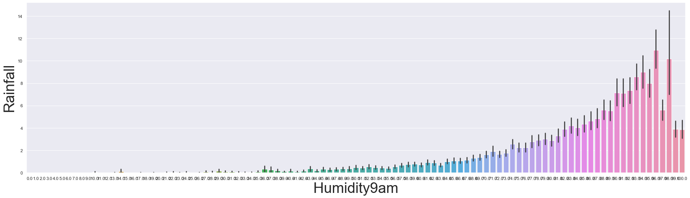

# Predict rain in Australia based on humidity on that day using DecisionTree Classifier

Where the humidity is high there is more moisture in the air and so more chance of clouds which increases the chance of rainfall.
Here also in this graph from the dataset we can see that when humidity increases the amount of rainfall increases. This is the reason why I predicted rain in Australia based on Humidity on the same day.

 
